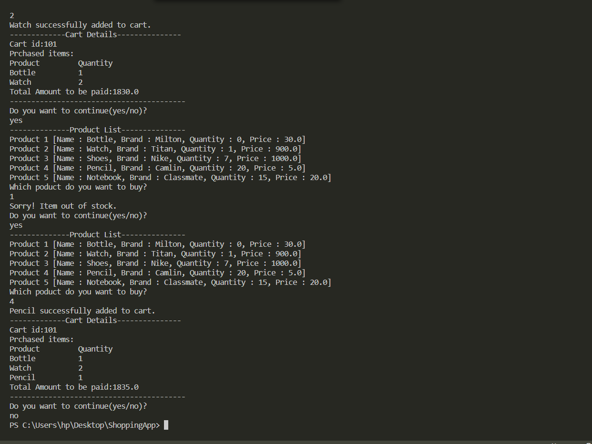
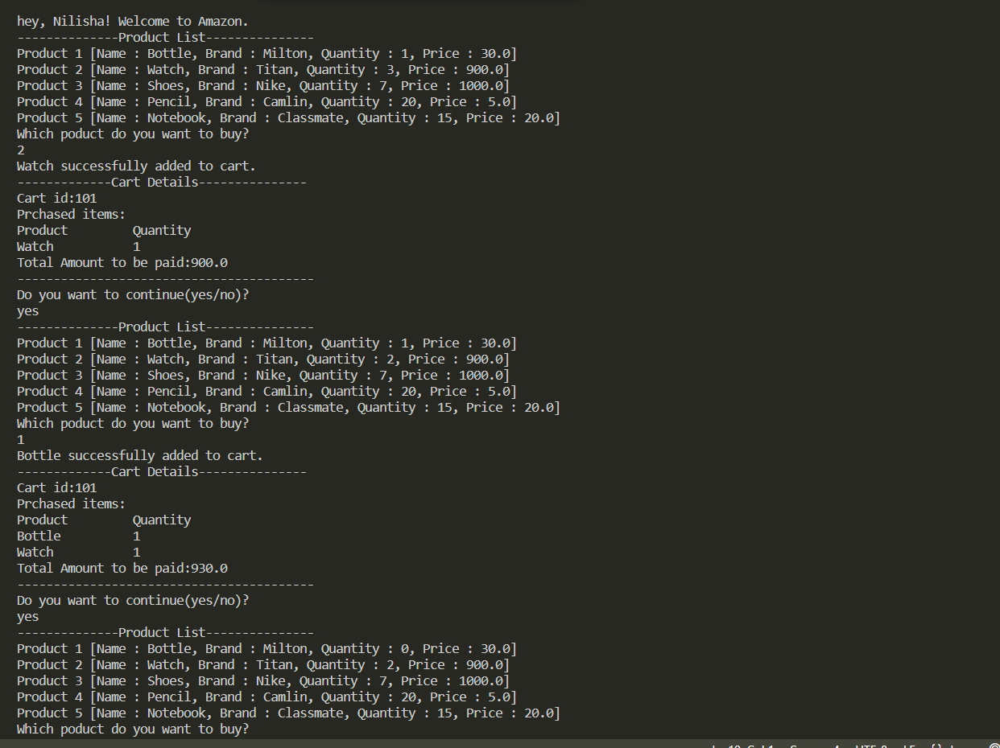

# Shopping Application
A shopping application made using java.
  
### Application Screenshots

### Tasks Done

- Three classes
    - Customer -1- name email phone

    - Product -- (name,brand,qty,price)(if : product added to cart then it must decrement by 1)

    - Cart-id,prodList,Cart Total;

- Create 5 product(whichever product is added to cart,the qty of that product should reduce by 1)

- Print Cart Total,Cart detail(all product with details name,price,qty)

- Inventory- list of all the products with quantity
